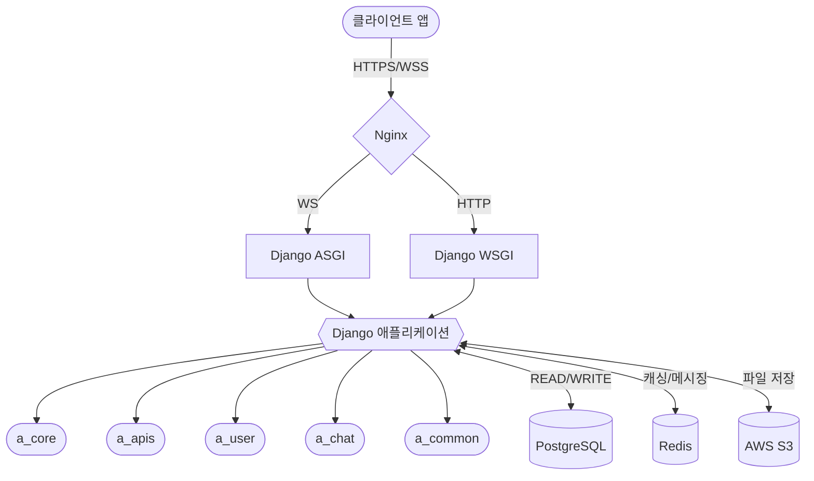

<br>

<div align=center>
  
</div>

## 🗓️ 개발 기간

2024.12.12 - 2025.01.16

## 📝 Introduce

> **CHAEUDA**
> 시골 빈집의 새로운 주인을 연결하는 플랫폼
> 편리하게 빈집을 올리고 구매자와 판매자가즉각적으로 소통할 수 있는 빈집 매매 플랫폼

## 🧑🏻‍💻 팀 소개 및 역할

<table>
  <thead>
    <tr>
      <th align="center"> LEADER/FE 주민재 </th>
      <th align="center"> FE 한효찬 </th>
      <th align="center"> FE 안지선 </th>
      <th align="center"> BE 김범준 </th>
      <th align="center"> BE 이재훈 </th>
      <th align="center"> BE 최승원 </th>
    </tr>
  </thead>
  <tbody>
    <tr>
      <td align="center">
        <a target="_blank" rel="noopener noreferrer nofollow" href="https://github.com/Ju-MINJAE">
          
        </a>
      </td>
      <td align="center">
        <a target="_blank" rel="noopener noreferrer nofollow" href="https://github.com/hanhyochan">
          
        </a>
      </td>
      <td align="center">
        <a target="_blank" rel="noopener noreferrer nofollow" href="https://github.com/jiseon-nnn">
          
        </a>
      </td>
      <td align="center">
        <a target="_blank" rel="noopener noreferrer nofollow" href="https://github.com/bamjun">
          
        </a>
      </td>
       <td align="center">
        <a target="_blank" rel="noopener noreferrer nofollow" href="https://github.com/Jeedoli">
          
        </a>
      </td>
      <td align="center">
        <a target="_blank" rel="noopener noreferrer nofollow" href="https://github.com/Kyubin1123">
          
        </a>
      </td>
    </tr>
    <tr>
      <td align="center">
        <a href="https://github.com/Ju-MINJAE">@Ju-MINJAE</a>
      </td>
      <td align="center">
         <a href="https://github.com/hanhyochan">@hanhyochan</a>
      </td>
      <td align="center">
        <a href="https://github.com/jiseon-nnn">@jiseon-nnn</a>
      </td>
      <td align="center">
        <a href="https://github.com/bamjun">@bamjun</a>
      </td>
       <td align="center">
        <a href="https://github.com/Jeedoli">@Jeedoli</a>
      </td>
         <td align="center">
        <a href="https://github.com/Kyubin1123">@Kyubin1123</a>
      </td>
    </tr>

  </tbody>
</table>

## 라이브 서버

<a href="https://www.chaeuda.shop/" target="_blank" rel="noopener noreferrer">채우다 | Chaeuda</a>
<br />

**테스트 아이디 / 비밀번호**
<br />
테스트 아이디: juminje@daum.net
<br />
비밀번호: Qq11@@

## Architecture Diagram


## Teck Stack

<div align=center>

### FE


<br />


<br />

### BE


### Cooperation


</div>

# 🏠 채우다(Chaeuda) - 부동산 매물 플랫폼


## 📋 프로젝트 소개

**채우다**는 부동산 매물 관리 및 거래 플랫폼으로, Django 프레임워크를 활용한 백엔드 API 서버입니다. 사용자가 부동산 매물을 쉽게 등록하고 검색할 수 있는 서비스를 구현했습니다.

### 주요 특징
- **매물 관리 시스템**: 다양한 유형의 부동산 매물 등록 및 관리
- **실시간 채팅**: WebSocket을 활용한 실시간 채팅 기능으로 판매자-구매자 간 소통
- **위치 기반 서비스**: 주소 및 좌표 기반 매물 검색
- **API 기반 설계**: RESTful API 패턴을 통한 확장 가능한 서비스 구조
- **컨테이너 기반 배포**: Docker와 GitHub Actions를 활용한 CI/CD 파이프라인

## 🔧 기술 스택

### 백엔드
- **언어 & 프레임워크**: Python 3.12, Django 5.1.6
- **API**: Django Ninja
- **데이터베이스**: PostgreSQL
- **비동기 처리**: Django Channels (WebSocket)
- **인증**: JWT 토큰 기반 인증

### 인프라
- **컨테이너화**: Docker, Docker Compose
- **웹 서버**: Nginx
- **CI/CD**: GitHub Actions
- **SSL/TLS**: Let's Encrypt
- **클라우드 서비스**: AWS
- **스토리지**: AWS S3

## 💻 주요 기능

### 1. 인증 및 사용자 관리
- JWT 기반 사용자 인증
- 이메일 인증 시스템
- 소셜 로그인 (Google)
- 사용자 프로필 관리

### 2. 매물 관리
- 매물 등록, 수정, 삭제, 조회
- 다양한 매물 유형 지원 (단독주택, 다세대 등)
- 상세 매물 정보 관리 (평수, 가격, 난방방식 등)
- 매물 이미지 및 동영상 관리

### 3. 위치 기반 서비스
- 주소 관리 및 좌표 변환
- 위치 기반 매물 검색
- 지도 API 연동

### 4. 실시간 채팅
- WebSocket을 활용한 실시간 메시지
- 매물별 채팅방 관리
- 1:1 채팅 지원

### 5. 관심 매물 관리
- 매물 찜하기 기능
- 관심 매물 목록 관리

## 🗂️ 프로젝트 구조

```
채우다(Chaeuda)/
├── django/                 # Django 애플리케이션
│   ├── a_core/             # 프로젝트 설정 및 코어
│   ├── a_apis/             # API 엔드포인트 및 비즈니스 로직
│   ├── a_user/             # 사용자 관련 기능
│   ├── a_chat/             # 채팅 시스템
│   └── a_common/           # 공통 모듈 및 유틸리티
├── nginx/                  # Nginx 설정
└── scripts/                # 유틸리티 스크립트
```

## 🏗️ 시스템 아키텍처

채우다 프로젝트는 마이크로서비스 지향적 아키텍처로 설계되어 있으며, Docker 컨테이너 기반으로 배포됩니다.



### 주요 컴포넌트 설명

1. **프론트엔드**: 웹/모바일 클라이언트 애플리케이션
2. **인프라 계층**:
   - **Nginx**: 리버스 프록시 및 로드 밸런서 역할, 정적 파일 제공
   - **Docker**: 컨테이너화된 서비스 관리
3. **백엔드 서버 계층**:
   - **Django ASGI (Daphne)**: WebSocket 처리, 실시간 채팅 기능
   - **Django WSGI (Gunicorn)**: HTTP API 요청 처리
4. **애플리케이션 계층**:
   - **a_core**: 프로젝트 핵심 설정 및 URL 라우팅
   - **a_apis**: API 엔드포인트, 모델, 서비스 로직
   - **a_user**: 사용자 관리 및 인증
   - **a_chat**: 실시간 채팅 시스템
   - **a_common**: 공통 유틸리티
5. **데이터 계층**:
   - **PostgreSQL**: 관계형 데이터베이스
   - **Redis**: 캐싱, 세션 관리, 실시간 채팅 채널 레이어
   - **AWS S3**: 이미지 및 동영상 스토리지

## 🔍 주요 API 엔드포인트

### 인증 API
- `POST /api/auth/signup/`: 회원가입
- `POST /api/auth/login/`: 로그인
- `POST /api/auth/refresh/`: 토큰 갱신
- `POST /api/auth/email-verification/`: 이메일 인증

### 사용자 API
- `GET /api/users/me/`: 내 정보 조회
- `PATCH /api/users/me/`: 내 정보 수정

### 매물 API
- `GET /api/products/`: 매물 목록 조회
- `POST /api/products/`: 매물 등록
- `GET /api/products/{id}/`: 매물 상세 조회
- `PUT /api/products/{id}/`: 매물 수정
- `DELETE /api/products/{id}/`: 매물 삭제
- `POST /api/products/{id}/likes/`: 관심 매물 등록/해제

### 채팅 API
- `GET /api/chats/list/`: 내 채팅방 목록
- `POST /api/chats/create/`: 채팅방 생성
- WebSocket 연결: `ws://domain/ws/chat/{room_id}/`

## 📊 ERD 설계


## 🚀 로컬 개발 환경 설정

### 사전 요구사항
- Python 3.12 이상
- Poetry
- Docker & Docker Compose

### 설치 및 실행

1. 레포지토리 클론
```bash
git clone git@github.com:chaeuda-TEAM/oz-main-be-06-team2.git
cd oz-main-be-06-team2
```

2. Poetry로 의존성 설치
```bash
poetry install
poetry shell
```

3. Django 설정
```bash
cd django
poetry run python manage.py makemigrations --settings=a_core.settings.development
poetry run python manage.py migrate --settings=a_core.settings.development
```

4. 개발 서버 실행
```bash
poetry run python manage.py runserver --settings=a_core.settings.development
```

5. API 문서 접속
```
http://127.0.0.1:8000/api/docs
```

### Docker를 통한 실행
```bash
docker-compose up -d
```

## 🔄 CI/CD 워크플로우

GitHub Actions를 통한 CI/CD 파이프라인:
- develop → main 브랜치 병합 시 자동 배포
- 테스트 자동화 및 품질 검사
- Docker 이미지 빌드 및 배포
- 데이터베이스 마이그레이션 자동화

## 📝 성과 및 배운 점

- **확장 가능한 아키텍처 설계**: 마이크로서비스 지향적인 구조로 모듈 간 의존성 최소화
- **실시간 기능 구현**: WebSocket을 활용한 실시간 채팅 시스템 구축
- **클라우드 서비스 활용**: AWS S3, RDS 등 클라우드 서비스 통합
- **CI/CD 자동화**: GitHub Actions을 활용한 배포 파이프라인 구축
- **보안 강화**: JWT 토큰 기반 인증 및 HTTPS 적용

## 📈 향후 개선 계획

- 알림 시스템 구축 (FCM, WebPush)
- 검색 기능 최적화 (Elasticsearch 도입)
- 추천 시스템 구현
- 성능 모니터링 도입 (Prometheus, Grafana)
- 다국어 지원 확장

## 👨‍💻 팀 구성원

- **백엔드 개발**: 팀 채우다
- **이메일**: team@chaeuda.shop
- **웹사이트**: https://chaeuda.shop
- **GitHub**: https://github.com/chaeuda-TEAM

---

© 2025 채우다(Chaeuda) 프로젝트

# 풀리퀘 작성 방법
1. 풀리퀘 작성 전 현재 브랜치 상태 확인
```
git status
```

2. 풀리퀘 작성 전 브랜치 업데이트
```
git pull origin main
```

test can merge
git status
```

2. 풀리퀘 작성 전 브랜치 업데이트
```
git pull origin main
```

test can merge
